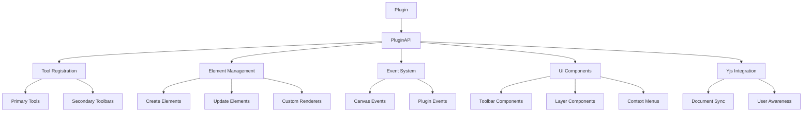

# Plugin Development

Welcome to the Jammwork Plugin Development documentation. This guide will help you create powerful plugins for the Infinite Canvas system.

## What Are Plugins?

Plugins are self-contained modules that extend the Infinite Canvas with custom functionality without modifying the core canvas code. They can add:

- **Custom drawing tools** - Create specialized tools for specific use cases
- **UI components** - Add toolbar buttons, layer components, and context menus  
- **Element types** - Define new shapes and interactive elements
- **Real-time features** - Build collaborative experiences with Yjs integration

## Key Features

### 🎨 Tool System
Create custom drawing and interaction tools with mouse/keyboard event handling.

### 🧩 Element Types
Register custom element renderers for new shapes and interactive components.

### 🔄 Real-time Collaboration
Built-in Yjs synchronization for collaborative editing and presence awareness.

### 🎯 Event-Driven Architecture
React to canvas events and emit custom events for plugin communication.

### 📱 UI Extensions
Add toolbar components, context menus, and canvas overlay layers.

### 🔧 Secondary Toolbars
Group related tools together with expandable secondary toolbars.

## Plugin Architecture



## Quick Start

### 1. Create Plugin Structure

```
src/plugins/my-plugin/
├── index.ts              # Main export
├── MyPlugin.tsx          # Plugin definition
├── tools/                # Tool definitions
├── components/           # UI components
└── store.ts             # State management
```

### 2. Basic Plugin

```typescript
import type { Plugin, PluginAPI } from '@jammwork/api';

export const MyPlugin: Plugin = {
  id: 'my-plugin',
  name: 'My Plugin',
  version: '1.0.0',
  
  activate: (api: PluginAPI) => {
    // Register tools, components, etc.
  }
};
```

### 3. Register Plugin

```typescript
<InfiniteCanvas plugins={[MyPlugin]} />
```

## Development Environment

The plugin system supports hot reloading during development. Based on your Vite configuration:

```typescript
// vite.config.mts
export default defineConfig({
  server: {
    port: 4200,
    host: "localhost",
  },
  plugins: [react(), tailwindcss(), tsconfigPaths()],
});
```

## What's Next?

- **[Getting Started](./getting-started)** - Create your first plugin
- **[Plugin Architecture](./architecture)** - Understand the system design
- **[API Reference](./api-reference)** - Complete API documentation
- **[Examples](./examples/basic-plugin)** - Learn from working examples

## Community

- 📂 [GitHub Repository](https://github.com/jammwork/jammwork)
- 🐛 [Report Issues](https://github.com/jammwork/jammwork/issues)
- 💬 [Discussions](https://github.com/jammwork/jammwork/discussions)